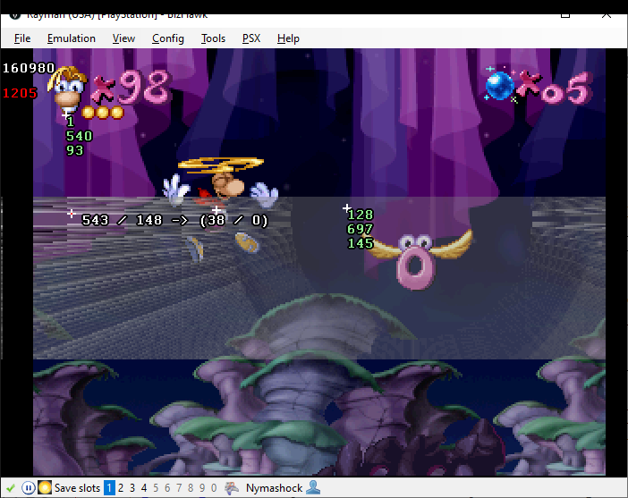

# RayTools | Ringboost Visualizer

A collection of Lua Scripts for BizHawk to show available ringboosts for a given ring in-game. 
This allows to easily get a visual understanding of where ringboosts are located, and where you need to position yourself to get the best ring boost.

The script consists of two parts:

- The heatmap is statically generated by the RingBoosts.lua script.
  Values are sampled in-game by performing a ringboost in a level with a given ring and recording the position into a file.
  Multiple heatmaps can be stitched together by the attached "HeatmapMerger" C# program.
  As the heatmap is the same for every ring (ignoring obstacles in the way), the heatmap can then just be saved into a CSV file.
- Display the heatmap with the RingMapper.lua script.
  Note that due to performance reasons with BizHawk, the heatmap is written into a PNG file first. This is done using the external "HeatmapVisualizer" C# program, also included with the scripts.
  Note that this setup is currently aggressively Windows-only.
  
  In-game, you can click on a ring with the mouse to show the heatmap for that ring.
  Click anywhere else to clear the heatmap.
  You can filter out particularly high ringboosts by adjusting the `heatmap_visualizer_args` variable inside the script.
  